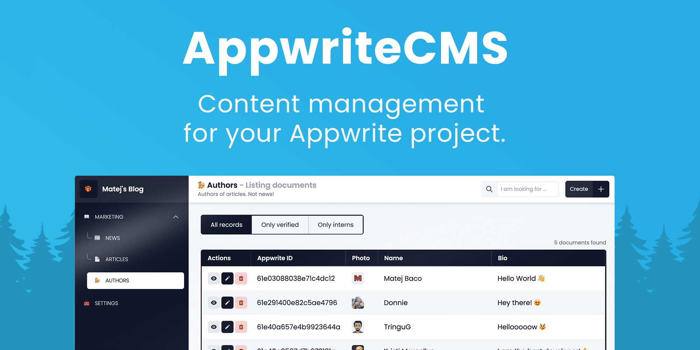

# 👋 Introduction

AppwriteCMS is headless CMS for your Appwrite database. Appwrite allows you to manage your database and files, but the UI is too developer-ish and allows zero customization. In the end, it is a tool for developers, not copywriters, so no one ever expected to use Appwrite as CMS. That's where AppwriteCMS comes into play! Connect AppwriteCMS to your Appwrite project and configure it as much as you need. AppwriteCMS also allows you to write your own components to achieve any interface your project needs.

At its core, AppwriteCMS is open-sourced and self-hosted Nuxt application that takes a `config.json` config file and generates s whole CMS from it. The only adapter that is currently supported is Appwrite, so as of right now, you can only use AppwriteCMS with Appwrite backend.

AppwriteCMS is supposed to be **SIMPLE**. It was created with a clear set of goals that include:

* **Simple** to set up for everyone
* **Simple** to use for content managers
* **Simple** to extend for developers

AppwriteCMS is a **simple** static website and no additional backend is required, not customization to your existing Appwrite project. We decided to make AppwriteCMS headless so it can work along with any Appwrite project. Since it's a static website, it can be easily hosted for free on any FTP web hosting provider, or cloud providers such as [Vercel](https://vercel.com) or [Netlify](https://www.netlify.com).

This is a very young project and we would love to hear your feedback! Please use [GitHub issues](https://github.com/Meldiron/appwrite-cms) to provide any feedback, bug report, feature request or to simply start a discussion about your problem.\
